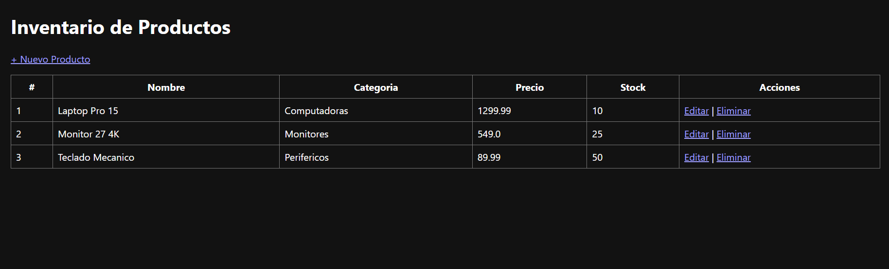
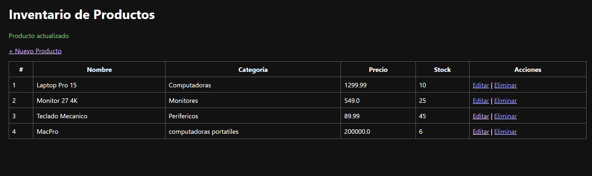
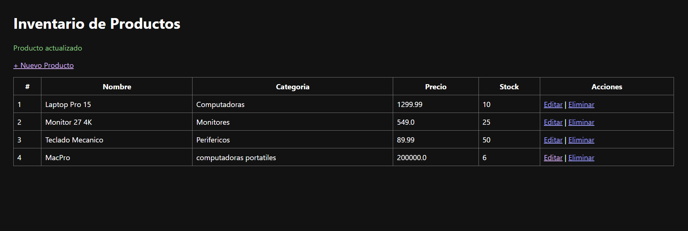

# U6 PostContenido 1 - CRUD MVC de Productos

Aplicacion MVC con Servlet, capa DAO en memoria y JSP para CRUD completo.

## Requisitos
- Java 11+ (recomendado 17)
- Maven 3.8+
- Tomcat 10.x

## Ejecutar
1. Compilar:
   ```bash
   mvn clean package
   ```
2. Desplegar `target/mvc-productos-1.0-SNAPSHOT.war` en Tomcat.
3. Abrir:
   `http://localhost:8080/mvc-productos/productos`

## Funcionalidades
- Listar, crear, editar y eliminar productos
- Validacion basica de nombre/precio/stock
- PRG en operaciones POST

## Entrega GitHub
Nombre sugerido: `apellido-post1-u6`

## Capturas de Pantalla de la Aplicación

**1. Listado de Productos (Tabla Principal):**


**2. Formulario de Registro (Nuevo Producto):**


**3. Formulario de Edición (Actualizar Producto):**
